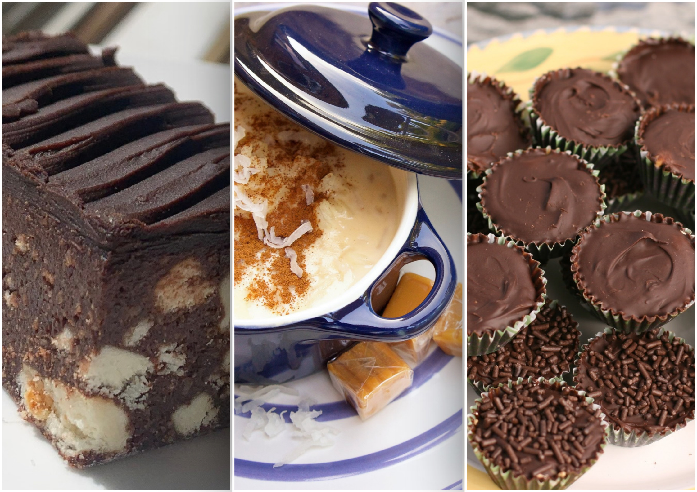

# Recipe Website

My first web development project through [The Odin Project](https://www.theodinproject.com/) Foundations course.

This project introduced me to building a basic multi-page website with HTML, including page structure, links, images, lists, and semantic elements.

[🧑🏻‍🍳 Live Site Preview!](https://amhyr11.github.io/recipe-website/)

Combined recipe preview banner designed by me.

Original Images (CC):

Hedgehog Slice
https://commons.wikimedia.org/wiki/File:Hedgehog_slice_aus_(cropped).jpg  

Rice Pudding
https://www.flickr.com/photos/cuponeando/6148140863

Peanut Butter Cups
https://www.flickr.com/photos/lonbinder/2603211897/
